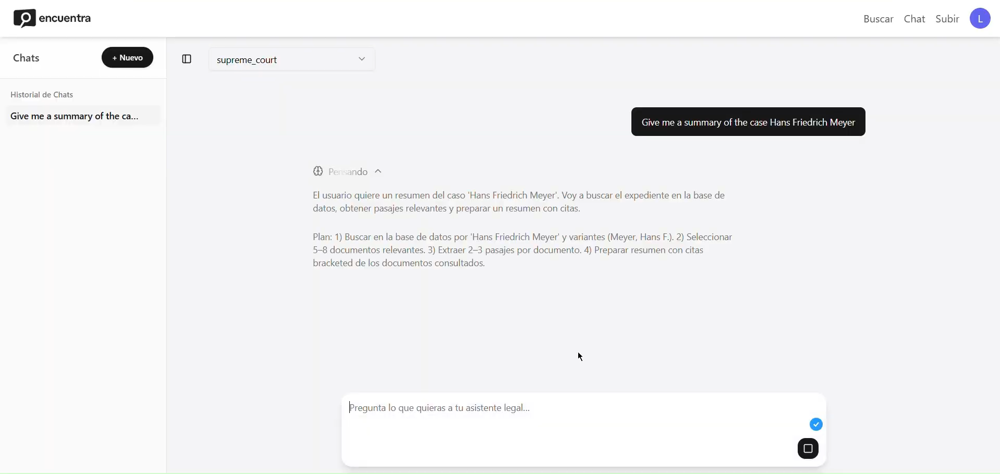

# Encuentra -- Full‑stack legal search and chat application with a FastAPI backend and React frontends.

<!--  -->
<p align="center">
    
</p>

<p align="center">
    
</p>

The project is organised as a monorepo:

- `backend/` – FastAPI "Encuentra API" that indexes a document corpus and serves search, file and chat endpoints (BM25 or OpenSearch backends).
- `frontend/` – main React + Vite app (Supabase auth, chat UI, search experience).
- `landing/` – marketing/landing site built with React + Vite.
- `data/` – local static corpus used by the default in‑memory BM25 backend.

For backend‑specific details (BM25 vs OpenSearch, environments, `.env` layout), see [backend/README.md](backend/README.md).

## Tech stack

- **Backend:** Python, FastAPI, Uvicorn, OpenSearch or in‑memory BM25 (`rank-bm25`), S3 integration via `boto3`.
- **Frontend:** React, Vite, Tailwind CSS, Radix UI, Supabase (auth & database), Vitest + Testing Library.
- **Infra (optional):** OpenSearch / OpenSearch Serverless, S3‑style object storage, App Runner or similar container runtime.

## Getting started

Clone the repo and switch into the project directory:

```bash
git clone <your-fork-or-origin-url>
cd encuentra
```

### 1. Backend (FastAPI)

Create and activate a Python virtualenv (Python 3.10+ recommended), then install dependencies:

```bash
cd backend
pip install -r requirements.txt
```

Set up your environment (local dev example):

```bash
cp ../env.staging .env   # or create .env manually
# then edit .env to match your local OpenSearch / BM25 settings
```

Run the API with Uvicorn:

```bash
uvicorn app.main:app --reload --host 0.0.0.0 --port 8000
```

By default the backend uses the bundled BM25 index and `data/static_corpus/corpus.jsonl`. See [backend/README.md](backend/README.md) for configuring OpenSearch, AOSS and multi‑env `.env` files.

### 2. Frontend (app)

In a separate terminal, install dependencies and start the React app:

```bash
cd frontend
npm install
npm run dev
```

The dev server typically runs on `http://localhost:5173`. Ensure the backend CORS `ALLOWED_ORIGINS` includes this origin.

### 3. Landing site (optional)

The marketing / landing site is in `landing/` and can be run separately:

```bash
cd landing
npm install
npm run dev
```

## Testing

- **Backend tests:** from `backend/`, run:

  ```bash
  pytest
  ```

- **Frontend tests:** from `frontend/`, run:

  ```bash
  npm test
  ```

## Project structure

```text
encuentra/
	backend/    # FastAPI API, search engines, models and services
	frontend/   # main React app (search & chat UI)
	landing/    # marketing site
	data/       # local static corpus for BM25
```

For more detailed backend configuration and environment examples, see [backend/README.md](backend/README.md).
